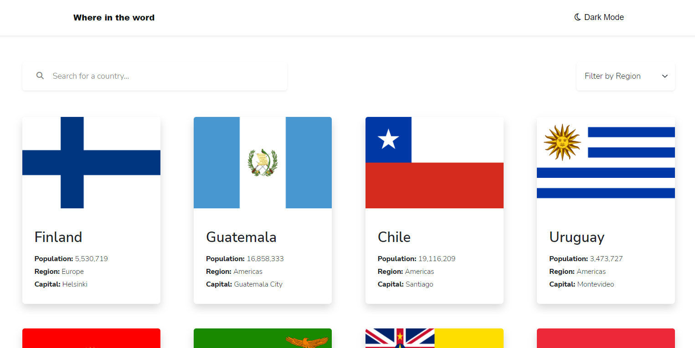
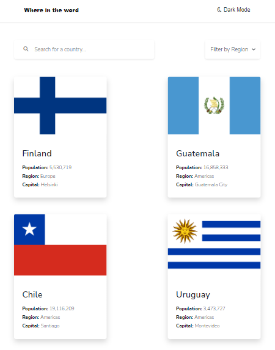
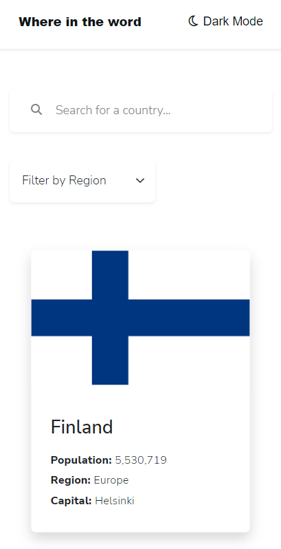

# REST-API-countries-with-color-theme-switcher

This is a solution to the REST Countries API with color theme switcher challenge on Frontend Mentor.
the challenge is to integrate with the [REST Countries API](https://restcountries.com) to pull country data and display it like in the designs.


## Table of contents

- [Overview](#overview)
    - [The challenge](#the-challenge)
    - [Screenshot](#screenshot)
    - [Links](#links)
- [My process](#my-process)
    - [Built with](#built-with)
    - [What I learned](#what-i-learned)
    - [Command Line](#command-line)
- [Author](#author)

## Overview

### The challenge

Users should be able to:

- See all countries from the API on the homepage
- Search for a country using an input field
- Filter countries by region
- Click on a country to see more detailed information on a separate page
- Click through to the border countries on the detail page
- Toggle the color scheme between light and dark mode (optional)

### Screenshot





### Links

- Solution URL: [REST-Countries-API](https://github.com/ermix3/REST-Countries-API)
- Live Site URL: [Live](https://ermix3.github.io/REST-Countries-API/)

## My process

### Built with

- Semantic HTML5 markup
- CSS custom properties
- Flexbox
- Mobile-first workflow
- [Sass](https://sass-lang.com/) - CSS Preprocessor
- [Bootstrap](https://getbootstrap.com/) - CSS Framework
- [Vue.js](https://vuejs.org/) - JS library

### What I learned

> I learn more about Vuejs and practice Sass language this time, Also really i learn a lot about API and that exactly what i want in the first place to be honest from this challenge thank you team [Frontend Mentor](https://www.frontendmentor.io/).

### Command Line

> Project setup
```
npm install
```

> Compiles and hot-reloads for development
```
npm run serve
```

> Compiles and minifies for production
```
npm run build
```

> Builds the production version of the site
```
npm run deploy
```

## Author

- Website - [ermix3](https://github.com/ermix3)
- Frontend Mentor - [@ermix3](https://www.frontendmentor.io/profile/ermix3)
- Twitter - [@re_ermix](https://www.twitter.com/re_ermix)

